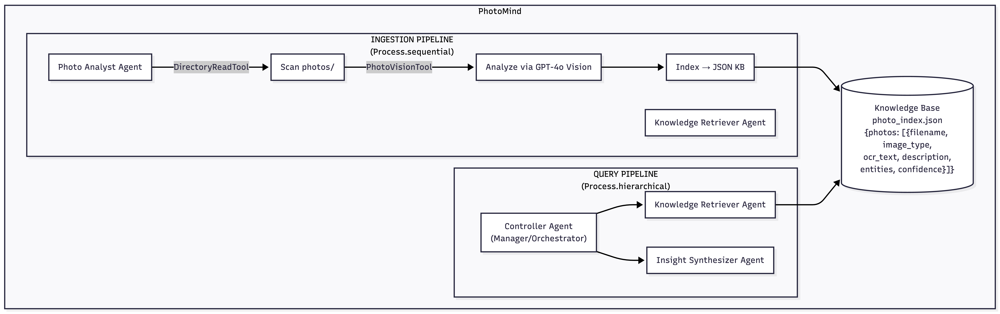
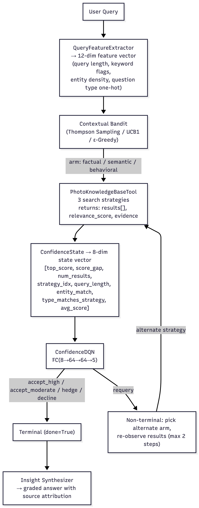

<div align="center">

# PhotoMind

**Multimodal Personal Photo Knowledge Retrieval System**

<h3><a href="https://photomind.vercel.app/">https://photomind.vercel.app</a></h3>

[](#)
[](#)
[](#)
[](#)
[](#)
[](#)
[](#)

_Built for INFO 7375 -- Prompt Engineering for Generative AI (Northeastern University, Spring 2026)_

**Raghu Ram Shanta Rajamani** -- [shantharajamani.r@northeastern.edu](mailto:shantharajamani.r@northeastern.edu)

[What It Does](#what-it-does) · [The Stack](#the-stack) · [Architecture](#architecture) · [Setup](#setup) · [Usage](#usage) · [RL Extension](#reinforcement-learning-extension) · [Evaluation Results](#evaluation-results) · [Project Structure](#project-structure)

</div>

> This repository contains code for three incrementally developed assignments, each on its own branch:
>
> | Assignment                                                     | Branch                                                                                                                                  |
> | -------------------------------------------------------------- | --------------------------------------------------------------------------------------------------------------------------------------- |
> | **Generative AI Project Assignment** (Final Project)           | [`main`](https://github.com/raghuneu/PhotoMind) ← _you are here_                                                                        |
> | Take-Home Final: Reinforcement Learning for Agentic AI Systems | [`feature/reinforcement-learning-extension`](https://github.com/raghuneu/PhotoMind/tree/feature/reinforcement-learning-extension)       |
> | Building Agentic Systems Assignment                            | [`feature/building_agentic_systems_assignment`](https://github.com/raghuneu/PhotoMind/tree/feature/building_agentic_systems_assignment) |

<div align="center">

You took a photo of a grocery receipt last Tuesday. Now you need to know exactly what you spent. You could scroll through 500 photos, or you could just ask.

PhotoMind turns your phone's photo library into a queryable knowledge base. It analyzes photos with GPT-4o Vision, indexes them into a hybrid vector search engine, and answers natural-language questions with confidence scores and source attribution. Two RL components -- contextual bandits for query routing and a DQN for confidence calibration -- eliminate silent failures entirely.

</div>

<p align="center">
  <a href="https://www.youtube.com/watch?v=UQRdkW2mAgc">
    
  </a>
</p>

<p align="center">
  <strong>Repository:</strong> <a href="https://github.com/raghuneu/PhotoMind">github.com/raghuneu/PhotoMind</a> · <strong>Demo:</strong> <a href="https://www.youtube.com/watch?v=UQRdkW2mAgc">youtu.be/UQRdkW2mAgc</a>
</p>

---

<h2 align="center">What It Does</h2>

| Step              | What Happens                                                   | Details                                                                                     |
| ----------------- | -------------------------------------------------------------- | ------------------------------------------------------------------------------------------- |
| **1. Ingest**     | Scans `photos/` and analyzes each image with GPT-4o Vision     | OCR, entity extraction, classification. Dual-writes to JSON + Qdrant vector DB. Idempotent. |
| **2. Index**      | Builds a hybrid-searchable knowledge base                      | Dense embedding ANN + keyword matching via Reciprocal Rank Fusion (RRF)                     |
| **3. Route**      | Classifies query intent automatically                          | Factual / Semantic / Behavioral — RL bandit or rule-based fallback                          |
| **4. Retrieve**   | Searches KB with the best strategy for the query type          | Entity matching, keyword overlap, or frequency aggregation                                  |
| **5. Synthesize** | Produces a grounded answer with confidence grade and citations | Grade A–F, numeric score 0–1, source photo filenames                                        |

Three query modes:

- **Factual** — "How much did I spend at ALDI?" → extracts $18.69 from receipt OCR
- **Semantic** — "Show me photos of pizza" → matches against visual descriptions
- **Behavioral** — "What type of food do I photograph most?" → aggregates patterns across all photos

Every answer includes a confidence grade (A–F) and cites the specific source photo.

---

<h2 align="center">The Stack</h2>

<h3 align="center">AI / Models</h3>

- **GPT-4o Vision** -- Photo analysis, OCR, entity extraction, classification
- **CrewAI** -- Multi-agent orchestration (4 agents, 2 crews)
- **sentence-transformers** -- `all-MiniLM-L6-v2` for local embeddings (384-dim)
- **PyTorch** -- DQN confidence calibrator
- **scikit-learn** -- KMeans clustering for bandit context features

<h3 align="center">Search & Storage</h3>

- **Qdrant** -- Vector database with hybrid search (dense ANN + keyword via RRF)
- **JSON fallback** -- Flat file backend for offline/RL training
- **Repository pattern** -- Swappable backends via ABC

<h3 align="center">Backend & API</h3>

- **FastAPI** -- REST API with LRU cache, API key auth, SSE streaming, multi-user scoping
- **Pydantic** -- Settings management, input validation

<h3 align="center">Frontend</h3>

- **React** + **TypeScript** + **Vite** -- SPA frontend
- **MUI** (Material UI) -- Component library
- **Recharts** -- Data visualization

---

<h2 align="center">Architecture</h2>

<p align="center">
  
</p>

```
INGESTION CREW (Process.sequential)
  [Scan photos/] → [Analyze with GPT-4o Vision] → [Build JSON knowledge base]
  (--direct flag available for faster batch processing via direct API calls)
  Dual-write: ingests into both JSON file and Qdrant vector DB simultaneously

QUERY CREW (Process.hierarchical, manager-delegated)
  [Controller] classifies query intent → delegates to specialists
    ├── Task 1: Knowledge Retriever — searches KB with PhotoKnowledgeBaseTool
    └── Task 2: Insight Synthesizer — synthesizes answer with confidence grade + citation

STORAGE LAYER (Repository Pattern)
  ├── QdrantPhotoRepository (default) — vector DB with hybrid search (RRF)
  └── JsonPhotoRepository (fallback)  — flat JSON file for offline/RL training

API SERVER (FastAPI)
  uvicorn api.server:app — REST API with LRU cache, API key auth, multi-user scoping

FEEDBACK LOOP (persistent, adaptive)
  [Eval results] → [FeedbackStore] → adjusts confidence thresholds per strategy
```

<h3 align="center">Agents</h3>

| Agent                   | Role                                                                        | Tools                                         |
| ----------------------- | --------------------------------------------------------------------------- | --------------------------------------------- |
| **Controller**          | Orchestrates query routing; classifies intent (factual/semantic/behavioral) | — (manager)                                   |
| **Photo Analyst**       | Analyzes images: OCR, entity extraction, classification                     | PhotoVisionTool, DirectoryReadTool            |
| **Knowledge Retriever** | Searches knowledge base; retrieves evidence                                 | PhotoKnowledgeBaseTool (custom), FileReadTool |
| **Insight Synthesizer** | Synthesizes grounded answers with confidence grading                        | FileReadTool, SerperDevTool (optional)        |

<h3 align="center">Tools</h3>

| Tool                     | Type                | Purpose                                                                           |
| ------------------------ | ------------------- | --------------------------------------------------------------------------------- |
| `PhotoVisionTool`        | Custom              | GPT-4o Vision wrapper with HEIC support (`src/tools/photo_vision.py`)             |
| `PhotoKnowledgeBaseTool` | Custom              | 3-strategy search with feedback integration (`src/tools/photo_knowledge_base.py`) |
| `DirectoryReadTool`      | Built-in            | Scans the photos directory                                                        |
| `FileReadTool`           | Built-in            | Reads the knowledge base file                                                     |
| `JSONSearchTool`         | Built-in            | Embedding-based JSON search (sentence-transformers)                               |
| `SerperDevTool`          | Built-in (optional) | Web search enrichment                                                             |

---

<h2 align="center">Setup</h2>

### Prerequisites

- Python 3.10–3.13 (CrewAI requires `< 3.14`)
- OpenAI API key (GPT-4o access)
- Docker (for Qdrant vector DB — optional, falls back to JSON)

### 1. Create a virtual environment

```bash
# If your system Python is 3.14+, use pyenv:
~/.pyenv/versions/3.10.14/bin/python3 -m venv .venv
source .venv/bin/activate

# Otherwise:
python3 -m venv .venv
source .venv/bin/activate
```

### 2. Install dependencies

```bash
pip install -r requirements.txt
```

First run downloads the `all-MiniLM-L6-v2` sentence-transformer model (~80MB) for local embeddings.

### 3. Configure API keys

```bash
cp .env.example .env
# Edit .env — add your OPENAI_API_KEY
```

**Required:**

- `OPENAI_API_KEY` — GPT-4o Vision + agent reasoning

**Optional:**

- `SERPER_API_KEY` — enables web search enrichment in answers
- `REPOSITORY_BACKEND` — `json` (default) or `qdrant` for vector DB

### 4. Create directories and add photos

```bash
mkdir -p photos knowledge_base eval/results
```

Place 15–25 photos in `photos/`. iPhone photos (HEIC format) are fully supported. Recommended mix for best demo coverage:

- Grocery/restaurant receipts (3–5)
- Food photos (3–5)
- Screenshots from apps or websites (1–2)
- Documents or notes (1–2)

### 5. Start Qdrant (vector database)

```bash
docker run -d --name qdrant -p 6333:6333 -p 6334:6334 qdrant/qdrant
```

Qdrant runs as a local Docker container. The ingestion pipeline auto-creates the `photos` collection on first write. If Qdrant is unavailable, the system falls back to the JSON file backend automatically.

---

<h2 align="center">Usage</h2>

### Ingest photos

```bash
# Default: CrewAI multi-agent pipeline
python -m src.main ingest

# Fast mode: direct API calls, bypasses CrewAI agents
python -m src.main ingest --direct
```

Analyzes all photos in `photos/` using GPT-4o Vision and dual-writes to `knowledge_base/photo_index.json` and Qdrant. Idempotent — re-running skips already-indexed photos.

### Query the knowledge base

```bash
python -m src.main query "How much did I spend at ALDI?"          # factual
python -m src.main query "Show me photos of pizza"                 # semantic
python -m src.main query "What type of food do I photograph most?" # behavioral
python -m src.main query "What was my electric bill?"              # edge case — should decline

# Fast path — skip CrewAI, zero OpenAI cost, sub-second latency
python -m src.main query --direct "How much did I spend at ALDI?"
```

### Run the API server

```bash
uvicorn api.server:app --reload --port 8000
```

The FastAPI server exposes the knowledge base and RL models as a REST API. Two query modes:

- **Fast** (`mode: "fast"`) — direct Python search with RL routing, no OpenAI calls, <1s, free
- **Full** (`mode: "full"`) — CrewAI pipeline with GPT-4o reasoning, 15–45s, ~$0.01–0.05/query

<h3 align="center">API Endpoints</h3>

| Endpoint              | Method | Auth    | Description                                                                                            |
| --------------------- | ------ | ------- | ------------------------------------------------------------------------------------------------------ |
| `/api/query`          | POST   | API key | Query the knowledge base                                                                               |
| `/api/query/stream`   | POST   | API key | SSE streaming variant — emits `routing`/`retrieval`/`token`/`done` events for progressive UI rendering |
| `/api/knowledge-base` | GET    | —       | List all indexed photos                                                                                |
| `/api/health`         | GET    | —       | Health check with backend status                                                                       |
| `/api/cache/clear`    | POST   | API key | Clear the LRU query cache                                                                              |
| `/api/feedback`       | POST   | API key | Submit feedback for adaptive thresholds                                                                |
| `/api/eval/results`   | GET    | —       | Latest evaluation results                                                                              |

**Headers:**

- `X-API-Key` — required for POST endpoints when `API_KEY` is set in `.env`
- `X-User-Id` — optional; scopes queries to a per-user Qdrant collection and JSON KB

Example query:

```bash
curl -X POST http://localhost:8000/api/query \
  -H "Content-Type: application/json" \
  -d '{"query": "How much did I spend at ALDI?", "mode": "fast"}'
```

### Run the evaluation suite

```bash
python -m src.main eval
```

Runs 20 test queries across 4 categories and reports:

- Retrieval Accuracy — was the correct source photo found?
- Routing Accuracy — was the query intent correctly detected?
- Silent Failure Rate — did the system ever confidently return a wrong answer?
- Decline Accuracy — were impossible queries correctly refused?

Results saved to `eval/results/eval_results.json`. Run history appended to `eval/results/eval_history.json` for trend analysis.

### Train the RL components (offline, no API calls)

```bash
# Train both components across 5 seeds (4000 episodes each, ~120s total)
python -m src.main train

# Train with custom episode count
python -m src.main train 1000

# Run full RL evaluation: 5 configs x 5 seeds x 83 queries
python -m src.main rl-eval

# Run 7-config ablation study → eval/results/ablation_results.json
python -m src.main ablation
```

RL training runs entirely on the cached knowledge base (zero API cost). Requires an existing `knowledge_base/photo_index.json` — run ingestion first. Trained models are saved to `knowledge_base/rl_models/` and loaded automatically at query time.

---

<h2 align="center">Reinforcement Learning Extension</h2>

PhotoMind integrates two RL approaches that replace rule-based components:

<h3 align="center">Approach 1: Contextual Bandits — Query Routing</h3>

Replaces the keyword-based `_classify_query()` in `PhotoKnowledgeBaseTool` with a learned policy that selects the optimal search strategy (factual / semantic / behavioral) based on query features.

- **ThompsonSamplingBandit** — Beta posterior per context cluster, provably optimal exploration
- **UCBBandit** — UCB1 upper confidence bound per cluster
- **EpsilonGreedyBandit** — Baseline comparison
- Context clustering via KMeans on 396-dimensional hybrid query feature vectors (12 handcrafted + 384 MiniLM embedding dims)
- Training: 4000 episodes × 5 seeds on offline cached search results (zero API cost)

<h3 align="center">Approach 2: DQN — Confidence Calibration</h3>

Replaces static confidence thresholding with a DQN that learns when to accept, hedge, or decline retrieval results — directly addressing the silent failure problem.

- Architecture: FC(8→64) → ReLU → FC(64→64) → ReLU → FC(64→5), adapted from the LunarLander DQN (extended with a requery action)
- State: 8-dim vector (top score, score gap, result count, strategy index, query features, entity match indicators)
- Actions: `accept_high`, `accept_moderate`, `hedge`, `requery`, `decline`
- Reward: penalty matrix that heavily penalizes silent failures (confident-but-wrong answers)

Key result: **Full RL eliminates silent failures** (0.0% vs 1.8% baseline; p < 0.0001). See [Evaluation Results](#evaluation-results) for the full ablation table.

<h3 align="center">RL Architecture</h3>

<p align="center">
  
</p>

**Offline simulation training:** Both components are trained using `PhotoMindSimulator`, which pre-computes all 3 search strategies on all 83 queries once (zero API calls). Training 4000 episodes × 5 seeds × 2 components takes ~120 seconds on CPU.

---

<h2 align="center">Custom Tool: PhotoKnowledgeBaseTool</h2>

`src/tools/photo_knowledge_base.py` — the core differentiator.

**Three search strategies selected automatically by query intent:**

| Strategy       | Trigger Keywords                                    | How It Works                                                    |
| -------------- | --------------------------------------------------- | --------------------------------------------------------------- |
| **Factual**    | "how much", "date", "address", "items", "vendor"    | Entity matching + OCR text search                               |
| **Semantic**   | Default (no other match)                            | Keyword overlap on descriptions, normalized by meaningful words |
| **Behavioral** | "most", "often", "how many", "breakdown", "pattern" | Frequency aggregation across all photos                         |

**Output always includes:** confidence grade (A–F), numeric score (0–1), source photo filenames, and a plain-language summary.

**Input schema (Pydantic):**

```python
query: str               # Natural language question
query_type: str = "auto" # Force strategy or let tool classify
top_k: int = 3           # Number of results
confidence_threshold: float = 0.15  # Minimum score to include
```

---

<h2 align="center">Evaluation Results</h2>

<h3 align="center">Base System (53 photos, 20 queries — with Qdrant hybrid search)</h3>

| Metric              | Score      |
| ------------------- | ---------- |
| Retrieval Accuracy  | **100%**   |
| Routing Accuracy    | **85%**    |
| Silent Failure Rate | **0%**     |
| Decline Accuracy    | **100%**   |
| Avg Latency         | ~46s/query |

<h3 align="center">RL Extension (53 photos, 83 queries, 5 seeds)</h3>

| Config                 | Retrieval | Routing | Silent Fail | Decline Acc |
| ---------------------- | --------- | ------- | ----------- | ----------- |
| Baseline (rule-based)  | 87.5%     | 76.8%   | 1.8%        | 90.9%       |
| Bandit Only (Thompson) | 86.8%     | 66.4%   | **0.0%**    | 81.8%       |
| DQN Only               | 87.5%     | 76.8%   | **0.4%**    | **100.0%**  |
| Full RL (Thompson+DQN) | 87.5%     | 67.1%   | **0.0%**    | **98.2%**   |

<p align="center">Statistical tests (Full RL vs Baseline): silent failure p < 0.0001 (***), decline accuracy p = 0.016 (*)</p>

<p align="center">
  
</p>

---

<h2 align="center">Project Structure</h2>

```
PhotoMind/
├── api/
│   └── server.py                    # FastAPI REST API (LRU cache, auth, multi-user)
├── src/
│   ├── main.py                      # CLI entry point (ingest / query / eval / train / rl-eval / ablation)
│   ├── config.py                    # Pydantic settings (reads .env)
│   ├── ingest_direct.py             # Direct ingestion (1 API call/photo, dual-write)
│   ├── agents/
│   │   └── definitions.py           # 4 agent factory functions
│   ├── tasks/
│   │   ├── ingestion.py             # Scan, analyze, index tasks
│   │   └── query.py                 # Query task with intent routing
│   ├── crews/
│   │   ├── ingestion_crew.py        # Sequential ingestion pipeline
│   │   └── query_crew.py            # Hierarchical query pipeline
│   ├── tools/
│   │   ├── photo_vision.py          # PhotoVisionTool (GPT-4o Vision + HEIC)
│   │   ├── photo_knowledge_base.py  # PhotoKnowledgeBaseTool (custom) — RL-enhanced
│   │   ├── query_memory.py          # Query memory and deduplication
│   │   └── feedback_store.py        # FeedbackStore (adaptive threshold learning)
│   ├── storage/
│   │   ├── __init__.py              # Public exports (PhotoRepository, get_repository)
│   │   ├── repository.py            # ABC + JsonPhotoRepository + QdrantPhotoRepository + factory
│   │   └── qdrant_client.py         # Qdrant connection helper (hybrid search, RRF)
│   └── rl/
│       ├── rl_config.py             # Centralized RL hyperparameters and reward matrix
│       ├── feature_extractor.py     # Query → 396-dim hybrid feature vector
│       ├── contextual_bandit.py     # Thompson Sampling, UCB, epsilon-greedy bandits
│       ├── dqn_confidence.py        # ConfidenceDQN and ConfidenceDQNAgent
│       ├── replay_buffer.py         # Experience replay buffer (adapted from LunarLander)
│       ├── reward.py                # Reward computation for bandit and DQN
│       ├── simulation_env.py        # Offline training environment (zero API cost)
│       └── training_pipeline.py     # Orchestrates training across seeds
├── eval/
│   ├── test_cases.py                # 20 original hand-labeled test queries
│   ├── expanded_test_cases.py       # 63 new cases (incl. 14 ambiguous) — 83 total
│   ├── novel_test_cases.py          # 15 intent-shift queries for robustness testing
│   ├── run_evaluation.py            # Base system evaluation harness
│   ├── run_rl_evaluation.py         # RL 5-config comparison harness
│   ├── ablation.py                  # 7-config ablation with paired t-tests
│   ├── statistical_analysis.py      # CI, paired t-test, Cohen's d utilities
│   └── results/                     # JSON results + eval history
├── viz/
│   ├── plot_learning_curves.py      # Bandit regret, DQN rewards, posteriors, epsilon decay
│   ├── plot_ablation.py             # Grouped bar chart (7 configs x 4 metrics)
│   ├── plot_regret.py               # Cumulative regret comparison (3 bandit types)
│   ├── plot_before_after.py         # Before/after RL comparison plots
│   ├── generate_diagrams.py         # Architecture and flow diagrams
│   ├── figures/                     # Generated PNG and PDF figures
│   └── diagrams/                    # Mermaid diagram sources (.mmd)
├── scripts/
│   ├── train_full.py                # Full training + optional ablation
│   ├── train_bandit.py              # Standalone bandit training
│   ├── train_dqn.py                 # Standalone DQN training
│   ├── precompute_cache.py          # Pre-compute search strategy cache
│   ├── scaling_benchmark.py         # Scaling and performance benchmarks
│   ├── migrate_to_qdrant.py         # JSON → Qdrant migration utility
│   └── demo_comparison.py           # Rule-based vs RL before/after demo
├── knowledge_base/
│   ├── photo_index.json             # 53 indexed photos
│   └── rl_models/                   # Trained RL models
│       ├── bandit_thompson.pkl      # Trained Thompson Sampling bandit
│       └── dqn_confidence.pth       # Trained DQN confidence calibrator
├── tests/
│   ├── test_core.py                 # Core RL functionality tests (59 tests)
│   ├── test_search_strategies.py    # Search strategy correctness tests (18 tests)
│   └── test_repository.py           # Repository abstraction tests (13 tests)
├── web/                             # React + TypeScript + Vite frontend (MUI, Recharts)
│   ├── src/
│   │   ├── App.tsx                  # Main app component
│   │   ├── components/              # UI components
│   │   └── theme.ts                 # MUI theme configuration
│   ├── index.html
│   └── package.json
├── docs/
│   ├── figures/                     # Copied figures for GitHub Pages
│   ├── math_formulations.md         # Mathematical formulations for RL components
│   ├── mermaid_diagrams/            # Mermaid diagram sources
│   └── report/                      # LaTeX technical report (main.tex → main.pdf)
├── Dockerfile                       # Multi-stage build (Node frontend + Python backend)
├── .dockerignore
├── .env.example
├── .gitignore
├── LICENSE
├── requirements.txt
└── TECHNICAL_REPORT.md              # Full technical documentation (base system + RL extension)
```

---

<div align="center">

## License

MIT License

---

_This is an academic project demonstrating multimodal AI retrieval with reinforcement learning. Not intended for production use._

</div>
